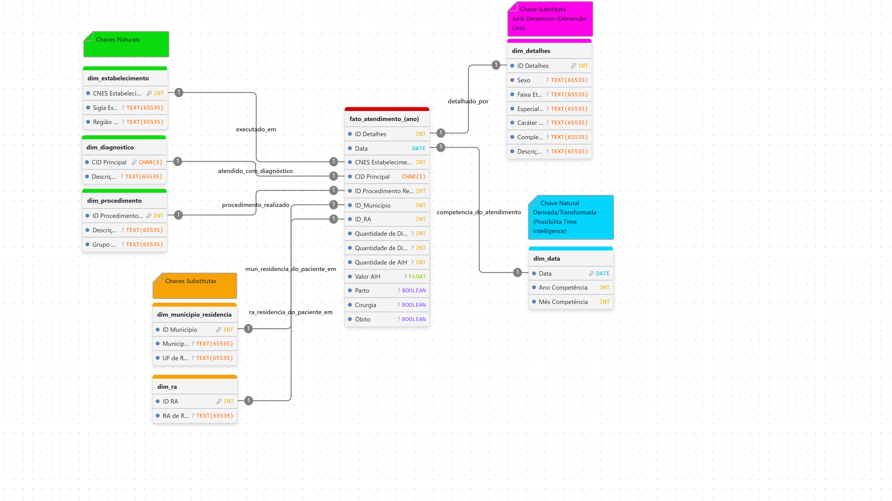

# Análise Hospitalar SUS-DF

> Painel analítico do desempenho da rede hospitalar do SUS no Distrito Federal entre 2022 e 2025, construído como instrumento de vigilância qualificada para o **Conselho de Saúde do Distrito Federal (CSDF)**.

**Projeto final da disciplina Business Intelligence II — CEUB.**

**Autores:** Erick Cardoso Mendes · Lucas Patriota Malinsk da Silva Pinto

---

## 1. Problema de negócio

O CSDF, órgão colegiado paritário previsto na Lei nº 8.142/1990, fiscaliza a aplicação dos recursos do SUS no DF. A leitura plurianual do desempenho da rede hospitalar — comparando exercícios e identificando deteriorações ou melhorias estruturais — depende hoje de relatórios pontuais da SES-DF em formatos não comparáveis.

Este projeto entrega à equipe técnica do CSDF um painel analítico permanente que responde à pergunta-âncora:

> **A saúde pública hospitalar do Distrito Federal melhorou ou piorou entre 2022 e 2025? E os gastos públicos, evoluem de forma sustentável?**

Documentação completa do problema, hipóteses e critério de sucesso em [`docs/problema_de_negocio.md`](docs/problema_de_negocio.md).

---

## 2. Dataset

- **Fonte:** API pública da Secretaria de Saúde do Distrito Federal — `https://api3.saude.df.gov.br/dados_csv/`
- **Volumetria:** 985.216 linhas, 26 colunas brutas, cobrindo competências de jan/2022 a mai/2026
- **Granularidade:** uma linha por AIH (Autorização de Internação Hospitalar) na competência mensal
- **Licença:** dado público (Lei nº 12.527/2011 — Lei de Acesso à Informação)

Dicionário completo de colunas e armadilhas de tratamento em [`data/README.md`](data/README.md).

---

## 3. Principais KPIs

O projeto define **11 KPIs** distribuídos em cinco eixos (produção, qualidade, financeiro, equidade, resolutividade). Os sete principais aparecem na página executiva do dashboard:

| Código | Indicador                      | Baseline (2022–25) | Meta                        |
| ------- | ------------------------------ | ------------------- | --------------------------- |
| K01     | Total de Internações         | 929k                | manter ±5% YoY             |
| K03     | Volume Médio Mensal           | ~19,3 mil/mês      | manter ±5% YoY             |
| K04     | Taxa de Mortalidade Hospitalar | 3,05%               | ≤ 3,00%                    |
| K07     | Custo Médio por Internação  | ~R$ 1.516           | crescimento YoY ≤ 5%       |
| K09     | Valor Total Investido          | R$ 1,41 bi          | crescimento real ≤ 5% a.a. |
| K13     | Tempo Médio de Permanência   | calculável         | reduzir 5% vs 2024          |
| K14     | Taxa de Uso de UTI             | calculável         | monitorar                   |

KPIs adicionais nas páginas temáticas: Mortalidade Infantil (K15), Mortalidade Idosos (K16), Cobertura RA Mapeada (K10), Concentração Top-3 Hospitais (K11). Fórmulas DAX, polaridade e racional completo em [`docs/kpis_okrs.md`](docs/kpis_okrs.md).

---

## 4. OKRs

**O1 — Manter a mortalidade hospitalar do SUS-DF sob controle.**
Manter mortalidade global ≤ 3,00% até Dez/2026; reduzir mortalidade em idosos 60+ em 5% vs 2024; reduzir mortalidade infantil em 10% vs 2024.

**O2 — Garantir sustentabilidade fiscal da rede hospitalar.**
Manter crescimento YoY do custo médio ≤ 5%; reduzir tempo médio de permanência em 5% vs 2024; manter valor total investido com crescimento real ≤ 5% a.a.

Detalhamento dos KRs e amarração explícita aos KPIs em [`docs/kpis_okrs.md`](docs/kpis_okrs.md), item 4.

---

## 5. Como abrir o `.pbip`

### Pré-requisitos

- Power BI Desktop **versão 2026.05 ou superior** com suporte ao formato PBIP/TMDL.
- Arquivo CSV consolidado em disco local. Para gerar: ver [`src/ingestion/README.md`](src/ingestion/README.md).

### Passos

1. Abrir `relatorio/analise.pbip`.
2. **Página Inicial → Gerenciar Parâmetros**.
3. Preencher `CaminhoBase` com o caminho absoluto local até `data/concat/dados_concatenados.csv` no seu disco. Exemplo: `C:\dev\analise-hospitalar-sus-df\data\concat\dados_concatenados.csv`.
4. **OK → Fechar e Aplicar**. Carregamento inicial leva 1–2 minutos para processar as 985k linhas.

---

## 6. Arquitetura do modelo (Star Schema)

A modelagem segue **Ralph Kimball**: uma tabela fato magra (`fato_atendimento`) conectada a sete dimensões por relacionamentos `1:N` unidirecionais.

[Diagrama interativo — DrawDB](https://www.drawdb.app/editor?shareId=6fe92f7fac81a8f17a74b9028610b5f5)



### Junk Dimension — `dim_detalhes`

Para evitar redundância de atributos textuais na fato, seis colunas de baixa cardinalidade individual (`Sexo`, `Faixa Etária`, `Especialidade de Leito`, `Caráter de Internação`, `Complexidade do Procedimento`, `Descrição Tipo Financiamento`) foram consolidadas em uma Junk Dimension. As ~1.200 combinações reais observadas em 985k linhas viram chave única `ID Detalhes`.

### Surrogate Keys

Chaves artificiais por faixas numéricas estritas para tornar a tabela de origem explícita em qualquer inspeção:

- `ID Município` em `dim_municipio_residencia`: inicia em **100**
- `ID RA` em `dim_ra_residencia`: inicia em **200**
- `ID Detalhes` em `dim_detalhes`: inicia em **300**
- `ID Atendimento` em `fato_atendimento`: prefixo `AT` + inteiro iniciando em **1000** (ex.: `AT1547`)

### Tabelas do modelo

| Tabela                       | PK                            | Cardinalidade aprox.                       |
| ---------------------------- | ----------------------------- | ------------------------------------------ |
| `fato_atendimento`         | `ID Atendimento`            | 985k                                       |
| `dim_data`                 | `Data`                      | ~60 (Power Query + colunas calculadas DAX) |
| `dim_detalhes` (Junk)      | `ID Detalhes`               | ~1.200                                     |
| `dim_estabelecimento`      | `CNES Estabelecimento`      | ~30                                        |
| `dim_diagnostico`          | `CID Principal`             | ~5.000                                     |
| `dim_procedimento`         | `ID Procedimento Realizado` | ~3.000                                     |
| `dim_ra_residencia`        | `ID RA`                     | ~35 (após trim)                           |
| `dim_municipio_residencia` | `ID Município`             | ~300                                       |
| `_Medidas`                 | —                            | dedicada a 52 medidas DAX                  |

Decisões de modelagem por escrito em [`docs/decisoes_de_modelagem.md`](docs/decisoes_de_modelagem.md).

---

## 7. Row-Level Security

O modelo expõe **9 papéis RLS** simulando o organograma do CSDF:

- **Presidente / Mesa Diretora CSDF** — visão total.
- **7 Câmaras Técnicas Regionais** (Central, Centro-Sul, Leste, Norte, Oeste, Sudoeste, Sul) — filtradas por Região de Saúde do estabelecimento.
- **Conselheiro Regional — Plano Piloto** — filtrado pela RA de residência do paciente.

Filtros DAX e validação detalhados em [`docs/decisoes_de_modelagem.md`](docs/decisoes_de_modelagem.md), item 8.

---

## 8. Estrutura do repositório

```
analise-hospitalar-sus-df/
├── README.md                       este arquivo
├── apresentacao/
│   └── slides.pdf                  apresentação final (10 min)
├── data/
│   ├── README.md                   dicionário de dados e armadilhas
│   ├── raw/                        CSVs anuais (ignorados pelo Git)
│   └── concat/                     CSV consolidado (ignorado pelo Git)
├── docs/
│   ├── problema_de_negocio.md      cenário, pergunta-âncora, stakeholders
│   ├── kpis_okrs.md                catálogo de KPIs, OKRs e cartões
│   └── decisoes_de_modelagem.md    racional do star schema, junk dim, RLS
├── img/
│   └── modelagem.png               diagrama do star schema
├── relatorio/
│   ├── analise.pbip                Power BI Project (abrir aqui)
│   ├── analise.Report/             definições visuais
│   └── analise.SemanticModel/      modelo semântico em TMDL versionado
└── src/
    ├── EDA/
    │   └── analise_exploratoria.ipynb   notebook Jupyter (finalizado)
    └── ingestion/
        ├── main.py                 pipeline de download + concat
        └── README.md               instruções de execução com uv
```

---

## 9. Versionamento

Repositório versionado em formato **PBIP/TMDL** — modelo semântico declarativo em texto puro, suportando code review e merge no Git. As pastas `data/` (CSVs locais) e os arquivos `localSettings.json`/`cache.abf` do Power BI estão ignorados via `.gitignore`.
